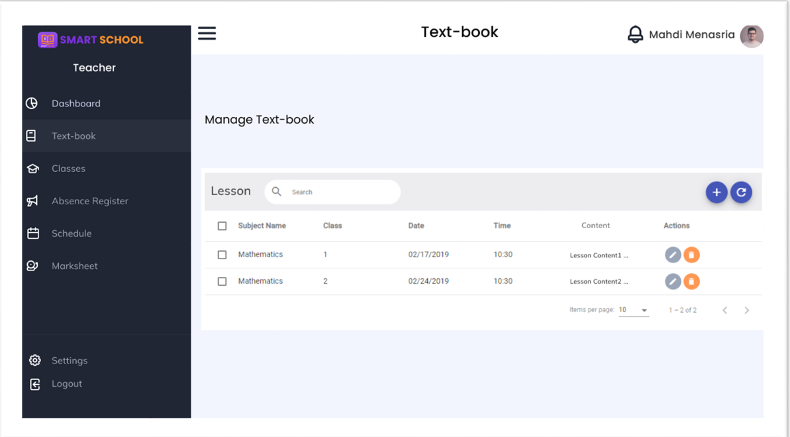
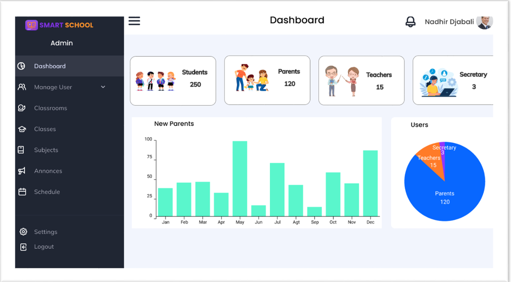
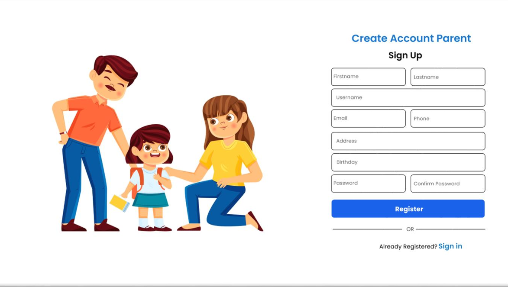

Smart Schooling System is a web-based School Management System that enables schools 
to utilise, run various integrated co-related modules and efficiently manage school administration. 
Because of its ever-growing and competitive character, the education industry has always required 
a Smart Schooling System to provide a superior solution for efficiently managing and serving school 
resources.

## Screenshots

